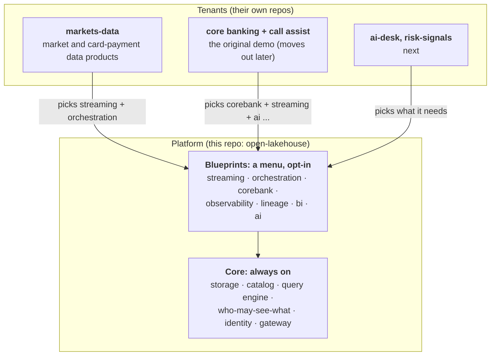
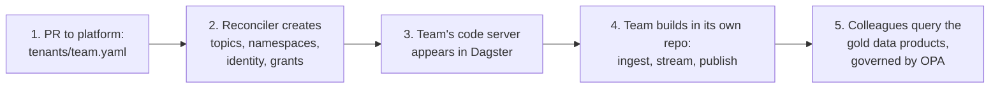
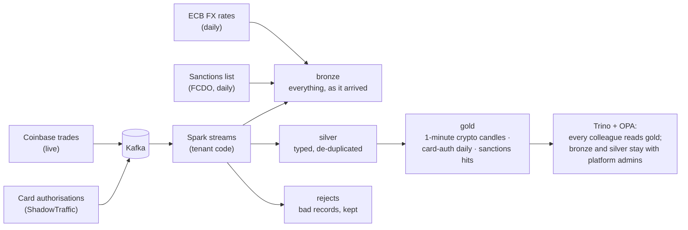

# One platform, a stack for every use case

**Start here if you are new.** This page explains what we are building and why, in plain words.
The other docs go deep on parts of it; this one gives you the picture to hang them on.

Some of what follows is built and some is the road ahead. Every section says which. Anything marked
**next** is agreed but not built yet ([next-steps](next-steps.md) tracks it).

## In one minute

A bank has data: customers, payments, market prices. Different teams want to use it in different
ways: analysts want tables, engineers want live streams, AI assistants want safe answers in under a
second. Doing that well needs a lot of hard, boring machinery: storage, a catalog, a query engine,
who-may-see-what, audit trails, scheduling.

We build that machinery **once**, as a **platform**, and run it on a laptop to prove it works. Teams
(we call them **tenants**) then build their own data products and AI tools on top, **in their own
repos**, and turn on only the parts of the platform they need.

> **One platform, many use cases, and each team chooses what to run.**
> Want the markets data demo? Start its stack. Want the core-banking demo? Start that one.
> Want both? Start both. Tomorrow's AI team gets its own stack the same way.

## The picture

Think of a shared office building. The **platform team** is the landlord: power, water, locks,
CCTV, the lift. Each **tenant** is a company that rents a floor, brings its own people and its own
work, and decides which building services it actually uses. The landlord never does a tenant's work,
and a tenant never rewires the building.



## What we set out to prove

Everything we build maps to one of four claims. If a piece of work serves none of them, we question it.

| Claim | What it means | How we show it |
|---|---|---|
| **The platform works** | Governed data from source to answer, end to end, on one laptop | `make verify` (end-to-end checks) and `make chaos` (kill every component in turn) |
| **Scale works** | The same code runs bigger by turning knobs, not by rewriting | `SCALE=laptop\|full`, memory budgets, [scale model](scale.md) |
| **Federation works** | Teams own their repos and data; sharing across teams is governed, not ad hoc | one tenant file per team, OPA decides every read |
| **It is portable** | Any machine, any day; a new team can take it somewhere else | everything is Docker Compose, config and pinned images |

The laptop proves *behaviour*, not throughput: volumes are tiny on purpose.

## Who does what

Two kinds of repo, with a clear boundary ([ADR 14](adr/0014-platform-and-tenant-teams-in-separate-repos.md)).

| | Platform (`open-lakehouse`) | Tenant (e.g. `lakehouse-markets-data`) |
|---|---|---|
| **Owns** | Storage, catalog, query engine, policy, identity, Kafka, Dagster, the blueprints | Its ingestion and streaming code, contracts, data products, dashboards |
| **Tests** | Platform capabilities, using a tiny built-in **canary tenant**: reconcile, per-team identity, grants, memory budgets | Its own code and data: streams produce, gold is fresh, replay works |
| **Releases** | Versioned tags that tenants pin | Its own images, on its own schedule |
| **Talks to the other** | Publishes interfaces: network names, a Spark base image, a reusable CI workflow | Asks for its setup in one pull request: `tenants/<team>.yaml` |

The rule of thumb: **if it is a capability every team gets, it is tested here; if it is one team's
data or code, it is tested in that team's repo.** The platform does not need a real team's code to prove itself.

## The menu (blueprints)

A **blueprint** is a group of services that solve one kind of problem. The core is always on. The rest are
opt-in. A tenant declares what it needs and the platform starts only that.

| Blueprint | What you get | Status |
|---|---|---|
| **core** | Postgres, object storage (RustFS), Iceberg catalog (Polaris), identity (Keycloak), policy (OPA), query engine (Trino), MCP gateway | built, always on |
| **streaming** | Kafka and the reconciler that creates a team's topics, namespaces and grants | built |
| **orchestration** | Dagster: schedules, asset pages, one code server per tenant | built |
| **corebank** | The bank's change data capture (Debezium and the CDC stream) and its Kafka topics. The seed and batch jobs run on demand, and Dagster's bank schedules follow this blueprint. | built |
| **observability** | Prometheus and Grafana: dashboards, SLOs, alerts | built, opt-in |
| **lineage** | Marquez: which job made which table | built, opt-in |
| **bi** | Superset SQL workbench that queries as *you* | built, opt-in |
| **ai** | Live Call Assist and its call simulator | built, opt-in |

`make SCALE=laptop` (the default) runs core, streaming, corebank, orchestration and tenants. `make SCALE=full` adds the
rest. Memory numbers for each are in [scale](scale.md#the-machine-it-runs-on-today-laptop-scale).

## A stack per use case

A stack is a list of blueprints. Today you pick it with `PROFILES`, and it already works:

```
make up                                                  # the bank demo: everything the laptop set has
make up PROFILES="streaming orchestration tenants"        # markets only: no CDC, no bank schedules
```

Measured on a 10 GB Docker VM: the markets-only stack used 4.7 to 4.9 GiB of containers, against 6.4 GiB
with `corebank`, and `make verify` passes on both (24 checks without the bank, 57 with it).

The direction (**next**) is that a *use case* picks its own stack by name, from what its tenant file declares:

```
make up USE=markets-data          # core + what markets-data declared it needs. No banking, no AI.
make up USE=bank                  # the original demo: core banking, CDC, call assist
make up USE="bank markets-data"   # both side by side
```

How a stack is chosen: each `tenants/<team>.yaml` will list its `blueprints:`. `markets-data` says
`[streaming, orchestration]`; a future AI team says `[ai]`. Only that tenant's own code server and services start.
Nothing runs that nobody asked for, which is also how we keep a 10 GB laptop healthy.
The reasoning is in [ADR 15](adr/0015-blueprints-and-a-stack-per-use-case.md).

## The life of a tenant

Onboarding is one pull request to this repo, then the team works in its own repo.



Nothing is granted by hand. A bad tenant file fails CI before it can reach a running stack.
Details and the file format are in [tenants/README](../tenants/README.md).

## Worked example: markets-data

`lakehouse-markets-data` is the first real tenant: a data engineering team building "Markets & Payments Intelligence".
It brings its own data and its own code; the platform brings everything else.



What it shows off, beyond the data itself:
- **Kappa-style reprocessing** (**next**, step 1.9): replay a Kafka topic into a new table version and switch readers, instead of a separate batch job.
- **Tenant choice at work:** on a laptop its streams run as small scheduled catch-ups; at full scale they run always on. The tenant reads `PLATFORM_SCALE` and decides.
- **The boundary:** this data lives in its own namespaces (`markets_bronze`, `markets_silver`, `markets_gold`) and its own identity. It cannot touch core banking's tables, and the platform's checks do not need its code.

## How data stays governed

Every read, from a person or an AI agent, goes through the same two layers
([ADR 2](adr/0002-two-layer-authorization.md)): the catalog says whether a table may be touched at all, and
OPA says which rows and columns this particular colleague may see. The demo colleagues make it concrete:

| Colleague | Role | Sees |
|---|---|---|
| alice | contact centre | Meridian customers only; personal details partly masked |
| bob | complaints | Meridian and Northgate; personal details in full |
| carol | analyst | all three brands, gold data products only; personal details hidden |
| ops_admin | platform admin | every layer including bronze, all brands; raw record payloads still hidden |

AI agents act **on behalf of** a colleague ([ADR 3](adr/0003-agents-act-on-behalf-of-colleagues.md)): the agent
never sees more than the person it is helping, and every lookup is audited.

## Glossary

- **Lakehouse:** data files in cheap object storage plus a catalog and a query engine, so you get database-style tables without a database.
- **Iceberg:** the table format. It gives files snapshots, schema changes and safe concurrent writes.
- **Bronze / silver / gold:** raw as-arrived, cleaned and typed, and ready-to-use data products.
- **Kafka topic:** a named, replayable stream of records.
- **Kappa:** one streaming path for everything; to reprocess, replay the stream.
- **CDC (change data capture):** turning a database's changes into a stream.
- **Catalog (Polaris):** the phone book that says which tables exist and where.
- **OPA:** the policy engine that decides who sees what.
- **Dagster:** the scheduler and asset catalog that runs the jobs.
- **Data contract:** a file describing a table's columns and their sensitivity; policy is generated from it.
- **MCP gateway:** the doorway AI agents use to call governed tools.
- **Tenant / blueprint / canary:** a team on the platform / a menu item it can switch on / the platform's own tiny test tenant.

## Where to go next

| I want to... | Read |
|---|---|
| Run it | [README](../README.md) quick start: `make demo` |
| See what fits on my machine | [scale](scale.md) |
| Onboard a team | [tenants/README](../tenants/README.md) |
| Understand why we chose this | [ADR 14](adr/0014-platform-and-tenant-teams-in-separate-repos.md), [ADR 15](adr/0015-blueprints-and-a-stack-per-use-case.md) |
| Fix something that broke | [runbooks](runbooks.md) |
| Pick up open work | [next-steps](next-steps.md) |
